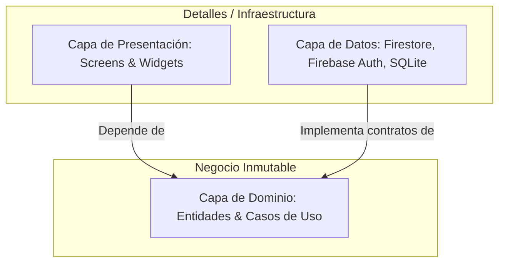

# 🏛 Arquitectura Limpia y Patrones de Diseño (`architecture/clean_architecture`)

**Koralis** implementa los principios de **Clean Architecture** (Arquitectura Limpia) propuestos por Robert C. Martin, adaptados al ecosistema moderno de **Flutter**. El objetivo es aislar la lógica de negocio de los detalles técnicos de infraestructura, servicios externos y marcos de presentación.

---

## 🎯 Regla de Dependencia

Las dependencias del código solo pueden apuntar **hacia adentro**, hacia la Capa de Dominio:



---

## 🏗 Las Tres Capas Fundamentales

Cada módulo dentro de [lib/features/](file:///d:/Projects/Flutter/koralis/lib/features) se organiza en tres capas estrictamente separadas:

### 1. Capa de Dominio (`domain/`)
Es el corazón del software. No contiene importaciones de Flutter UI ni de paquetes de infraestructura (como Firebase o SQLite). Es código Dart puro.

- **Entidades:** Clases inmutables que modelan los conceptos del negocio y encapsulan cálculos financieros (e.g. [Instrument](file:///d:/Projects/Flutter/koralis/lib/features/instruments/domain/entities/instrument.dart), [Client](file:///d:/Projects/Flutter/koralis/lib/features/clients/domain/entities/client.dart), [Transaction](file:///d:/Projects/Flutter/koralis/lib/features/transactions/domain/entities/transaction.dart)).
- **Contratos de Repositorio:** Interfaces abstractas que definen qué operaciones de datos necesita el negocio, sin importar de dónde provienen los datos:
  ```dart
  abstract class InstrumentRepository {
    Future<List<Instrument>> getInstruments(String userId);
    Future<void> saveInstrument(Instrument instrument);
    Future<void> deleteInstrument(String userId, String instrumentId);
  }
  ```
- **Casos de Uso (Use Cases):** Clases con una única responsabilidad (*Single Responsibility Principle*) que orquestan el flujo de datos para una acción específica (e.g. `GetClientsUseCase`, `SaveTransactionUseCase`).

### 2. Capa de Datos (`data/`)
Implementa los contratos definidos por el dominio, conectándose con los servicios externos.

- **Modelos y DTOs:** Adaptadores que deserializan y serializan mapas de Firestore (`fromMap` / `toMap`).
- **Implementaciones de Repositorio:** Clases concretas (e.g. `InstrumentRepositoryImpl`) que consumen el [FirestoreService](file:///d:/Projects/Flutter/koralis/packages/core/lib/src/firebase/firestore_service.dart) del paquete Core y traducen los documentos a entidades de dominio.

### 3. Capa de Presentación (`presentation/`)
Responsable de capturar la interacción del usuario y renderizar la interfaz gráfica.

- **Pantallas (Screens):** Vistas completas registradas en [router.dart](file:///d:/Projects/Flutter/koralis/lib/app/router.dart) (e.g. `InstrumentsScreen`, `TransactionFormScreen`).
- **Widgets Específicos:** Componentes visuales contextuales a la funcionalidad.
- **Inyección y Estados:** Los widgets consumen los Casos de Uso correspondientes para solicitar o actualizar información.

---

## 📦 Rol del Paquete Interno `packages/core`

Para evitar la duplicación de código y mantener la pureza de las capas:

- [packages/core](file:///d:/Projects/Flutter/koralis/packages/core) actúa como una **librería agnóstica de infraestructura transversal**.
- Expone:
  - Sistema de temas y diseño ([theme.dart](file:///d:/Projects/Flutter/koralis/packages/core/lib/src/theme.dart)).
  - Componentes gráficos reutilizables ([widgets.dart](file:///d:/Projects/Flutter/koralis/packages/core/lib/src/widgets.dart)).
  - Servicios de conexión Firebase y SQLite ([firestore_service.dart](file:///d:/Projects/Flutter/koralis/packages/core/lib/src/firebase/firestore_service.dart)).
  - Validadores y formateadores de datos ([validators.dart](file:///d:/Projects/Flutter/koralis/packages/core/lib/src/validators.dart)).
- **Regla de Oro:** Ningún archivo dentro de `packages/core` puede importar clases de `lib/features/`.

---

## 🧪 Inversión de Control y Testabilidad

Al desacoplar las implementaciones mediante interfaces abstractas, el sistema puede ser sometido a pruebas exhaustivas en milisegundos mediante dobles de prueba (*fakes* o *mocks*), tal como se demuestra en [multi_user_isolation_test.dart](file:///d:/Projects/Flutter/koralis/test/features/multi_user_isolation_test.dart), sin necesidad de conectarse a emuladores pesados ni a bases de datos en vivo.
