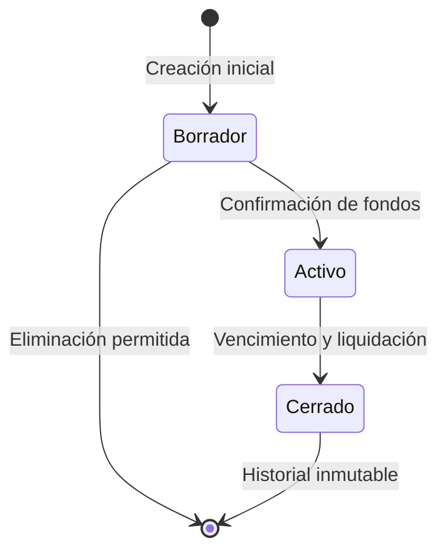

# 📈 Módulo de Instrumentos Financieros (`features/instruments`)

El módulo de instrumentos administra los productos de inversión (CDTs, fondos fiduciarios, bonos, pagarés) en el ecosistema **Koralis**, gobernando su ciclo de vida financiero, cálculos de rentabilidad y participación de clientes.

---

## 🏛 1. Modelo de Dominio

Ubicación: [instrument.dart](file:///d:/Projects/Flutter/koralis/lib/features/instruments/domain/entities/instrument.dart)

### Entidad Principal: `Instrument`

| Atributo | Tipo | Descripción |
|---|---|---|
| `id` | `String` | Identificador único del documento en Firestore. |
| `numero` | `String` | Código identificador del instrumento (e.g. `"CDT-908234"`). |
| `entidad` | `String` | Nombre de la entidad financiera emisora (e.g. `"Bancolombia"`). |
| `fechaApertura`| `DateTime` | Fecha inicial de colocación del capital. |
| `dias` | `int` | Plazo pactado en días calendario. |
| `tasaIea` | `double` | Tasa de interés efectiva anual (% I.E.A.). |
| `valorInvertido`| `double` | Capital monetario total colocado. |
| `rendimientoTProyec` | `double` | Rendimiento bruto estimado al vencimiento. |
| `retencionPorcentaje`| `double` | Porcentaje de retención en la fuente (por defecto 4.0%). |
| `observacion` | `String` | Anotaciones o cláusulas especiales. |
| `estado` | `String` | Estado operativo: `'Borrador'`, `'Activo'` o `'Cerrado'`. |
| `userId` | `String?` | ID del usuario propietario para aislamiento multi-tenant. |
| `participaciones` | `List<InstrumentClientShare>` | Lista de clientes inversores asociados. |

---

## 🧮 2. Fórmulas y Propiedades Calculadas

El modelo `Instrument` encapsula la lógica financiera para asegurar consistencia matemática en toda la aplicación:

```text
Fecha de Vencimiento:
    fechaCierre = fechaApertura + dias (días calendario)

Valor Total Bruto Recibido:
    valorRecibido = valorInvertido + rendimientoTProyec

Rendimientos Brutos:
    rendimientos = valorRecibido - valorInvertido

Retención en la Fuente:
    retencionValor = rendimientos * (retencionPorcentaje / 100)

Rendimiento Neto Final:
    valorFinalRend = rendimientos - retencionValor
```

---

## 📋 3. Formulario Reactivo: `InstrumentFormScreen`

Ubicación: [instrument_form_screen.dart](file:///d:/Projects/Flutter/koralis/lib/features/instruments/presentation/instrument_form_screen.dart)

El formulario de instrumentos organiza la captura de datos en **3 Pestañas (Tabs)**:

### Pestaña 1: Datos Generales
- Selección de la entidad financiera desde la colección global `banks` mediante `AppDropdownField`.
- Entrada de número de instrumento, fecha de apertura con `DatePicker` nativo y duración en días.
- Captura de capital invertido, tasa proyectada y porcentaje de retención.
- Resumen financiero dinámico en tiempo real que se recalcula a medida que el usuario digita los montos.

### Pestaña 2: Aportes de Clientes
- Permite vincular clientes registrados que dispongan de saldo a favor.
- Al agregar un aporte, se valida que el monto no supere el saldo disponible del cliente.
- Sumatoria reactiva de aportes para comparar contra el `valorInvertido` total del instrumento.

### Pestaña 3: Resultados y Cierre
- En modo edición, expone el balance consolidado del instrumento.
- Muestra el desglose de clientes partícipes y la proyección de sus retornos proporcionales netos de retención.

---

## 🔒 4. Estados Operativos y Restricciones de Negocio

El ciclo de vida del instrumento impone reglas estrictas de integridad:



1. **Estado `Borrador`:**
   - Permite modificar todos los valores del instrumento.
   - Permite agregar, editar o remover aportes de clientes libremente.
2. **Estado `Activo` (Restricción Crítica):**
   - Una vez formalizado el instrumento a estado **Activo**, los aportes de los clientes quedan **estrictamente bloqueados**.
   - No se permite agregar nuevos aportes, ni editar o borrar los existentes, garantizando la inmutabilidad de los fondos comprometidos.
3. **Estado `Cerrado`:**
   - Instrumento liquidado. Los rendimientos netos calculados se reintegran al disponible de cada cliente participante mediante transacciones de tipo `retorno`.

---

## 🗄 5. Persistencia y Aislamiento Multiusuario

Los instrumentos se persisten de manera aislada bajo la ruta canónica:
```text
users/{userId}/instruments/{instrumentId}
```
Esto garantiza que ningún usuario pueda consultar, calcular ni alterar instrumentos pertenecientes a otra cuenta.
