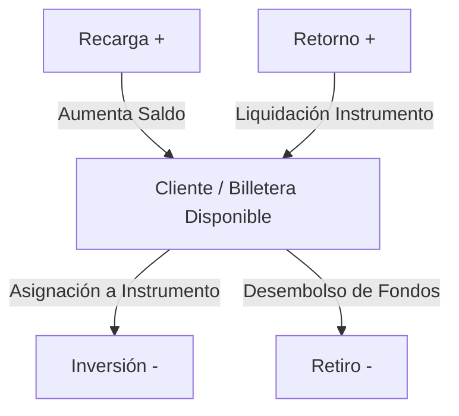

# 💸 Módulo de Transacciones Financieras (`features/transactions`)

El módulo de transacciones gestiona el flujo de caja, los movimientos monetarios de los clientes y la trazabilidad de fondos asignados a los instrumentos financieros en **Koralis**.

---

## 🧭 1. Tipología de Transacciones

Ubicación: [transaction.dart](file:///d:/Projects/Flutter/koralis/lib/features/transactions/domain/entities/transaction.dart)

Cada movimiento financiero se clasifica bajo el enumerador `TransactionType`:



| Tipo | Naturaleza | Signo | Impacto en Saldo Disponible | Color Sugerido | Ícono |
|---|---|---|---|---|---|
| `recarga` | Ingreso | `+` | **Aumenta** el disponible del cliente. | `#10B981` (Esmeralda) | `add_card_rounded` |
| `inversion` | Egreso | `-` | **Disminuye** el disponible (asigna a instrumento). | `#6366F1` (Índigo) | `trending_up_rounded` |
| `retorno` | Ingreso | `+` | **Aumenta** el disponible (capital + rendimientos). | `#0EA5E9` (Celeste) | `account_balance_rounded` |
| `retiro` | Egreso | `-` | **Disminuye** el disponible (desembolso de dinero). | `#F59E0B` (Ámbar) | `payments_rounded` |

---

## 🧮 2. Lógica Matemática del Saldo

Cada transacción expone una propiedad calculada llamada `valorFirmado`:

```dart
double get valorFirmado => esIngreso ? monto.abs() : -monto.abs();
```

El saldo disponible de un cliente se computa de forma determinista sumando algebraicamente el historial completo de sus movimientos:

```dart
double get saldoDisponible =>
    transacciones.fold(0.0, (acum, t) => acum + t.valorFirmado);
```

---

## 📱 3. Pantallas del Módulo

### `TransactionsScreen` (Visualización y Filtros Combinados)
Ubicación: [transactions_screen.dart](file:///d:/Projects/Flutter/koralis/lib/features/transactions/presentation/transactions_screen.dart)

- **Filtros Dinámicos:**
  - Por cliente específico o cartera global.
  - Por tipo de transacción (`recarga`, `inversion`, `retorno`, `retiro`).
  - Por período o rango temporal.
- **Listado Reactivo:**
  - Renderizado mediante `AppListCard` con avatar temático, fecha legible, badge cromático y monto firmado con formato monetario.
  - Estado vacío gestionado con `EmptyWidget` si no existen movimientos para el filtro aplicado.
- **Detalle Inferior:**
  - Al presionar una tarjeta, se despliega un modal inferior (`AppModalBottomSheet`) con el detalle completo del movimiento, comprobante de pago asociado y observaciones.

### `TransactionFormScreen` (Formulario de Registro)
Ubicación: [transaction_form_screen.dart](file:///d:/Projects/Flutter/koralis/lib/features/transactions/presentation/transaction_form_screen.dart)

- **Preselección de Cliente:** Permite abrir el formulario desde la ficha individual de un cliente o seleccionar uno desde el dropdown general.
- **Regla de Validación de Sobregiro:** En transacciones de egreso (`retiro` o `inversion`), el sistema valida que el monto solicitado no exceda el `saldoDisponible` del cliente, impidiendo saldos negativos.
- **Carga de Evidencia:** Opción para adjuntar comprobante gráfico almacenado en Firebase Storage.

---

## 🗄 4. Persistencia en Cloud Firestore

Las transacciones se persisten como una lista estructurada dentro del documento de cada cliente:
```text
users/{userId}/clients/{clientId} -> campo 'transacciones': [ { id, monto, tipo, fecha, ... } ]
```
Este diseño garantiza:
1. **Lecturas atómicas:** Al consultar un cliente, su saldo y transacciones se obtienen en una sola operación de lectura sin subconsultas costosas.
2. **Aislamiento absoluto:** Imposibilidad de mezclar transacciones entre clientes o entre usuarios propietarios.
